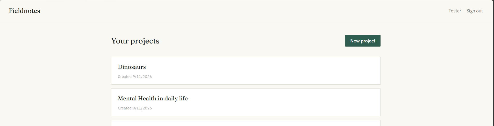
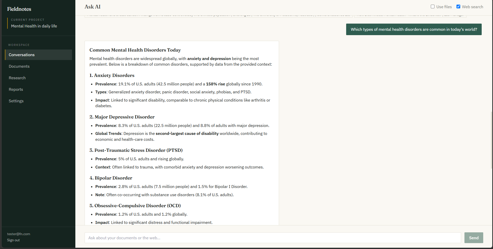
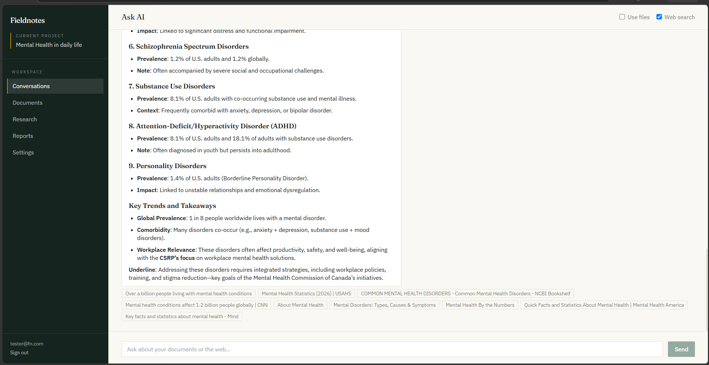
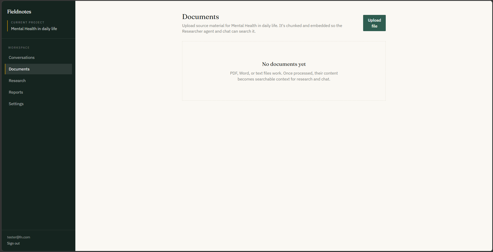
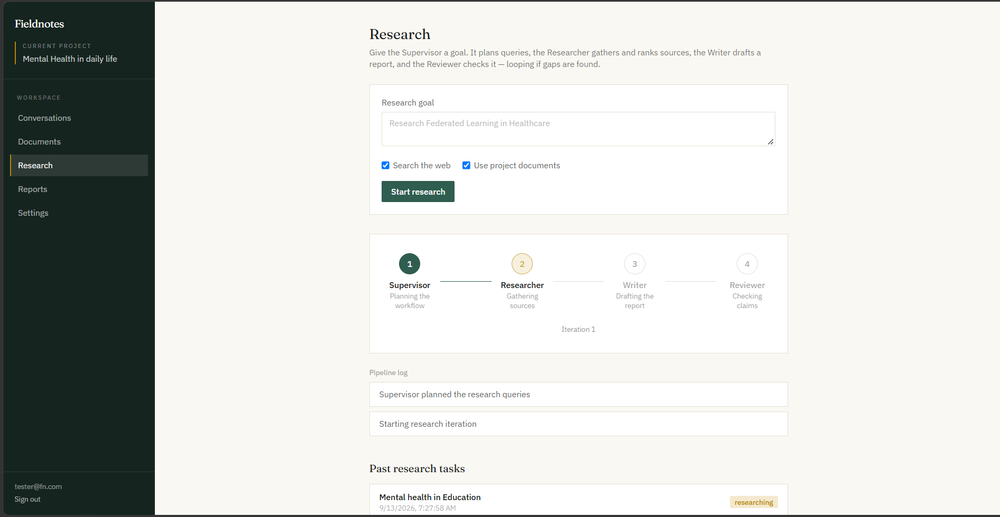
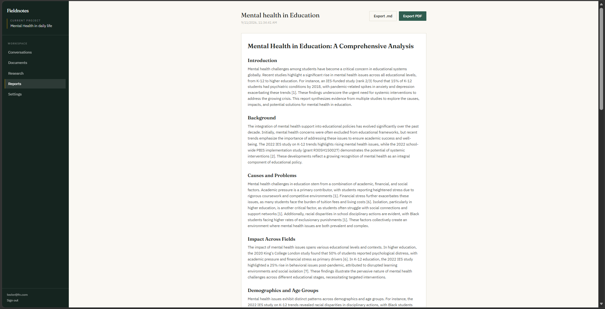
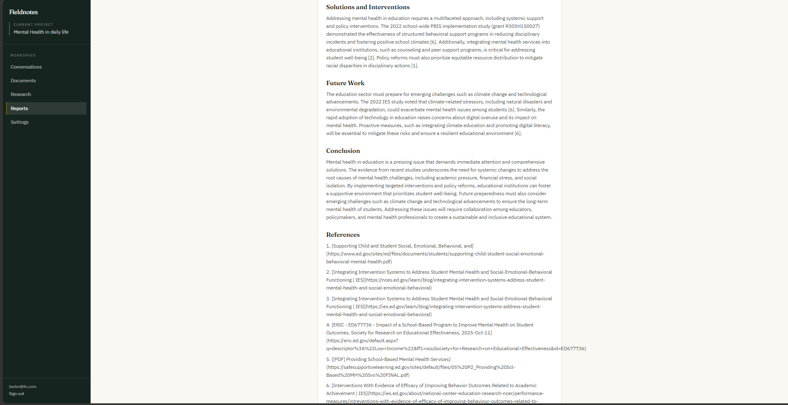

# AI Research Assistant

AI Research Assistant is a full-stack web application for managing research workflows using AI-powered conversations, document ingestion, web search, report generation, and project organization. The repository is divided into a React frontend in the `client/` directory and an Express/Mongoose backend in the `server/` directory.

## Project Purpose

The goal of this application is to help a user or research team collect information, organize documents, search the web, manage tasks, and turn research into structured reports. Users can sign up or log in, work across multiple projects, create research conversations, upload documents, and generate well-structured reports that summarize findings.

Unlike a simple chatbot, the project is designed around a research lifecycle. Research starts with a user request or task, continues through conversation and document processing, and ends with an accessible report or written output. The backend also includes retrieval, chunking, web search, and agent orchestration services that support a generated research workflow.

## Architecture

The repository has a clear separation between the user interface and the server-side services:

### Frontend

The `client/` folder contains the application UI built with:

- React
- Vite
- Tailwind CSS
- JSX UI components

The UI contains pages for:

- Login
- Registration
- Dashboard
- Conversations
- Documents
- Research tasks
- Reports
- Report viewer
- Settings
- Project layout

The pages are organized around a workflow where the user can browse projects, create or join research sessions, inspect documents, and review generated reports. The sidebar, timeline, and project layout create a navigation model for the app.

### Backend

The `server/` folder contains the API server and domain model. It uses:

- Express
- Node.js
- MongoDB via Mongoose
- JWT-based authentication
- Controllers, routes, middleware, models, utilities, and configuration files

The application server includes APIs for:

- Auth routes
- Conversation routes
- Document routes
- Project routes
- Report routes
- Research routes

The backend also contains a set of AI-related utilities such as:

- `webSearch.js` for external web search handling
- `textExtract.js` for extracting text from uploaded or indexed sources
- `chunker.js` for splitting content into manageable chunks
- `vectorStore.js` for retrieval-oriented storage and search support
- `translation.js` for language translation support
- `pdfExport.js` for exporting reports or content to PDF
- `sse.js` for streaming or event-driven communication support

## Data and Domain Model

The backend includes Mongoose models such as:

- `User.js`
- `Project.js`
- `Conversation.js`
- `Message.js`
- `Document.js`
- `Chunk.js`
- `Report.js`
- `ResearchTask.js`

These models form the primary data model for the research assistant. A user owns or participates in projects. Projects hold conversations, tasks, research records, documents, and generated reports. Documents can be indexed into chunks that are then searched with vector or text retrieval mechanisms.

## Agent Workflow

The server also contains an `agents/` area featuring multiple specialized orchestration and prompt files:

- `orchestrator.js`
- `researcherAgent.js`
- `reviewerAgent.js`
- `supervisorAgent.js`
- `writerAgent.js`
- `prompts.js`

This agent structure suggests a cooperative AI workflow where:

- A supervisor or orchestrator coordinates the research process.
- A researcher agent gathers information and identifies sources.
- A reviewer agent checks the quality, facts, and coherence of the output.
- A writer agent generates or improves the final report or answer.

The architecture is therefore not only a document management system or chatbot but a multi-agent research workflow that can coordinate useful outputs.

## User Experience Flow

A likely user journey for the application is:

1. Create an account or sign in.
2. Create or select a project.
3. Start a research conversation or research task.
4. Upload documents or search the web for sources.
5. Let the backend process documents into text chunks or vector stores.
6. Review findings through the conversation research interface.
7. Generate a report based on multiple sources.
8. Export or review the report in the report viewer.

This end-to-end workflow is consistent with the project’s design focus on research assistant capabilities rather than a single-question chat experience.

## Main Functional Areas

### Authentication

The authentication system uses Express routes and middleware in the server. The auth controller likely handles login, sign-up, token issuance, and access control. User sessions are protected by middleware that ensures private access to project and research resources.

### Projects and Research Organization

The project controller and project model support research workspaces where tasks, conversations, documents, and reports are assigned to a specific project. This allows a user to organize research by domain, company, topic, or team.

### Conversations and Messages

The conversation and message models manage the interactive chat-style research process. The conversation route and controller allow conversations to be created, read, updated, and managed in relation to research tasks and reports.

### Document Management

Document uploads and extraction are central to the system. The document controller likely supports adding files, processing text, and generating content chunks for vector search or semantic retrieval. The text extraction utility and chunker allow the app to transform unstructured documents into indexed, searchable units.

### Research and Web Search

The research controller and research routes coordinate research tasks. The `webSearch.js` utility suggests that the backend may support internet search and combine external findings with internal document knowledge. This makes the app suitable for a research workflow that combines open web context with uploaded knowledge.

### Reporting

The report model and report controller support report creation and viewing. Reports are likely the final deliverable that summarizes a research task, conversation, and discovered facts. The `pdfExport.js` utility indicates that the app supports exporting reports for users who need a printable or shareable research artifact.

## Project Quality and Extensibility

This repository is structured for extensibility. It separates:

- UI code in `client/src/`
- Server code in `server/src/`
- Models and database logic in `server/src/models/`
- Routing in `server/src/routes/`
- Controllers in `server/src/controllers/`
- Middleware in `server/src/middleware/`
- Utilities and AI processing flows in `server/src/utils/`

This organization makes the codebase easier to expand with new research workflows, new LLM agent types, different retrieval strategies, or additional export formats.

## Frontend Image Annotation Notes

The image folder contains the main workflow screenshots in the following order:

These screenshots represent the primary research workflow screens from the dashboard through the conversation, document, research, and report views.

## Summary

AI Research Assistant is a modern web application that connects a React frontend with an Express backend and MongoDB data model to support AI-assisted research workflows. It integrates documents, conversations, projects, web search, text extraction, chunking, vector storage, agent orchestration, and report generation into a single research platform.

The project is especially useful for users who need an organized system for gathering sources, chatting with an AI assistant during research, and turning findings into structured written outputs.
